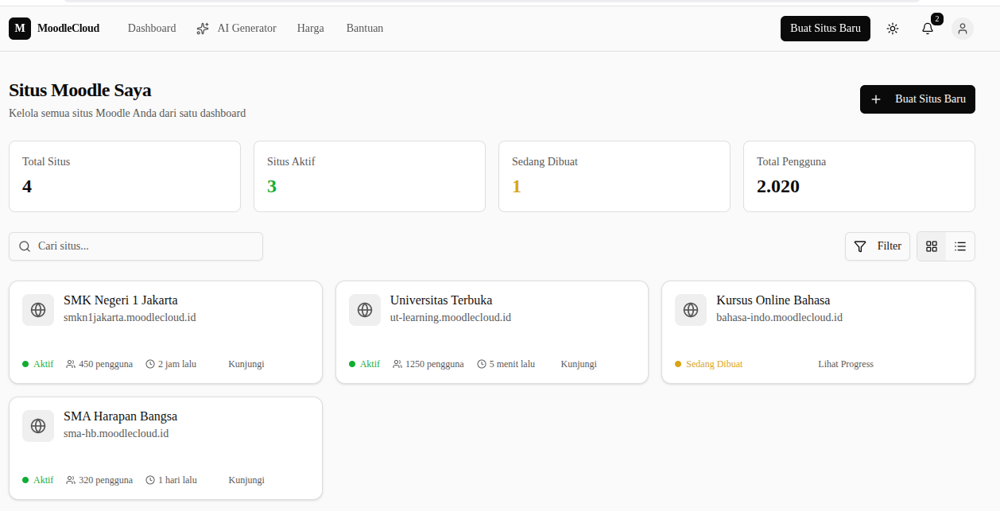

# MoodleCloud2

MoodleCloud2 is a local-first prototype for provisioning and managing Moodle sites. The repo is a monorepo with a Next.js frontend, a Go API, a Go background worker, and Docker-based local infrastructure for Postgres, Redis, Mailpit, Traefik, and Moodle site containers.

## Dashboard Preview



## Repository Layout

- `frontend/` - Next.js 16 App Router prototype UI with React 19, TypeScript, Tailwind 4, Radix UI, and Vercel Analytics.
- `backend/` - Go 1.26 API and worker code using Chi, pgx, Goose migrations, Redis-backed Asynq jobs, and Postgres.
- `docker/` - Local Moodle image assets used by the Docker provisioning runtime.
- `docker-compose.yml` - Local infrastructure for Postgres, Redis, Mailpit, and Traefik.

## Prerequisites

- Go 1.26
- Node.js and pnpm
- Docker and Docker Compose

## Local Setup

Start the shared local infrastructure:

```bash
docker compose up -d
```

Create local environment files:

```bash
cp backend/.env.example backend/.env
cp frontend/.env.example frontend/.env.local
```

Build the local Moodle runtime image used by site provisioning:

```bash
docker build -t local/moodle-app:5.1-local docker/moodle
```

Important local networking note: `docker-compose.yml` creates and uses the Docker network named `moodlecloud-proxy`. For local `docker_local` provisioning, make sure `backend/.env` uses:

```env
DOCKER_PROXY_NETWORK=moodlecloud-proxy
```

## Run Locally

Run the API from one terminal:

```bash
cd backend
go run ./cmd/api
```

Run the background worker from another terminal:

```bash
cd backend
go run ./cmd/worker
```

Run the frontend from a third terminal:

```bash
cd frontend
pnpm dev
```

The API runs migrations automatically in development when `RUN_MIGRATIONS=true`. It also seeds the local Playwright user unless `SEED_PLAYWRIGHT_USER=false`.

## Useful Local URLs

- Frontend: `http://localhost:3000`
- API health check: `http://localhost:8080/v1/healthz`
- Mailpit: `http://localhost:8025`
- Traefik dashboard: `http://localhost:8088`
- Provisioned Moodle sites: `http://<subdomain>.lvh.me`

## Seed Account

The API can seed a verified local user for smoke tests and development:

- Email: `playwright@example.com`
- Password: `Playwright123!`

These defaults are configured in `backend/.env.example`.

## Build And Test

Run backend tests:

```bash
cd backend
GOCACHE=/tmp/go-build GOMODCACHE=/tmp/go-mod-cache go test ./...
```

Run frontend type checking:

```bash
cd frontend
pnpm exec tsc --noEmit
```

Run a frontend production build:

```bash
cd frontend
pnpm exec next build --webpack
```

`pnpm lint` exists in `frontend/package.json`, but this repo currently has no ESLint config, so do not rely on it until a config is added.

## Common Local Issues

If site provisioning cannot connect Moodle containers to the proxy, confirm that the Docker network exists and that `DOCKER_PROXY_NETWORK=moodlecloud-proxy` is set in `backend/.env`.

If provisioned sites do not respond, confirm Traefik is running, the worker is running, and the local Moodle image exists:

```bash
docker image ls local/moodle-app
```

If auth emails or reset emails do not appear, open Mailpit at `http://localhost:8025` and confirm the backend SMTP settings still point to `localhost:1025`.

If the frontend cannot reach the API, confirm `frontend/.env.local` contains:

```env
NEXT_PUBLIC_API_BASE_URL=http://localhost:8080/v1
```
